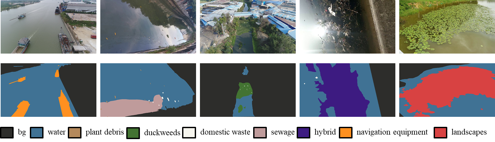
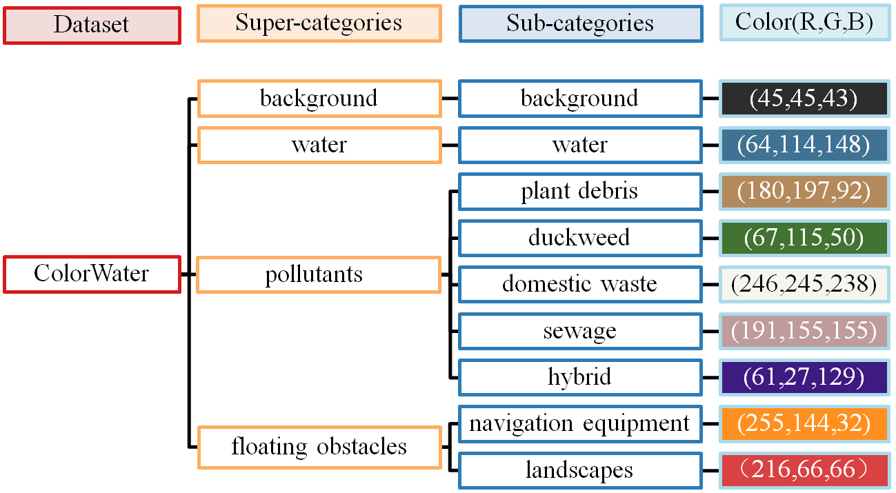

# ColorWater
A Diverse Dataset and Benchmark for Semantic Water Surface Understanding.
## Description
ColorWater is a diverse semantic segmentation dataset tailored for the comprehensive understanding of the complex water surface. ColorWater collects 1279 complex water surface images containing various floating objects through field collection and online search. To finely describe the various floating objects on complex water surfaces, ColorWater provides pixel-level annotations consisting of 9 categories that include background, water, plant debris, duckweed, domestic waste, sewage, navigation equipment, hybrid, and landscape.

## Annotations
The category hierarchical structure of ColorWater as follow. The last column reflects the color-to-category correspondence in the visualization ground truth.

