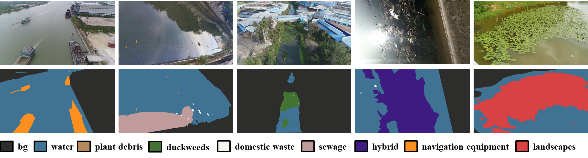

# ColorWater
A Diverse Dataset and Benchmark for Semantic Water Surface Understanding.

## Description
ColorWater is a diverse semantic segmentation dataset tailored for the comprehensive understanding of the complex water surface. ColorWater collects 1279 complex water surface images containing various floating objects through field collection and online search. To finely describe the various floating objects on complex water surfaces, ColorWater provides pixel-level annotations consisting of 9 categories that include background, water, plant debris, duckweed, domestic waste, sewage, navigation equipment, hybrid, and landscape.



## Annotations
The category hierarchical structure of ColorWater as follow. The last column reflects the color-to-category correspondence in the visualization ground truth.


## Download

[ColorWater](https://pan.baidu.com/s/1DdaWR30HLBOEoz9-ca6u2Q), code:***data***

## Citation
Please consider citing our paper in your publications if you find ColorWater Dataset helps your research:
```
@InProceedings{Liang2022,
author="Liang, C. and Cai, W. and Peng, S. and Liu, Q.",
editor="Gama, J. and Li, T. and Yu, Y. and Chen, E. and Zheng, Yu and Teng, F.",
title="Detail Perception Network for Semantic Segmentation in Water Scenes",
booktitle="Advances in Knowledge Discovery and Data Mining",
year="2022",
publisher="Springer International Publishing",
address="Cham",
pages="187--199"
```
